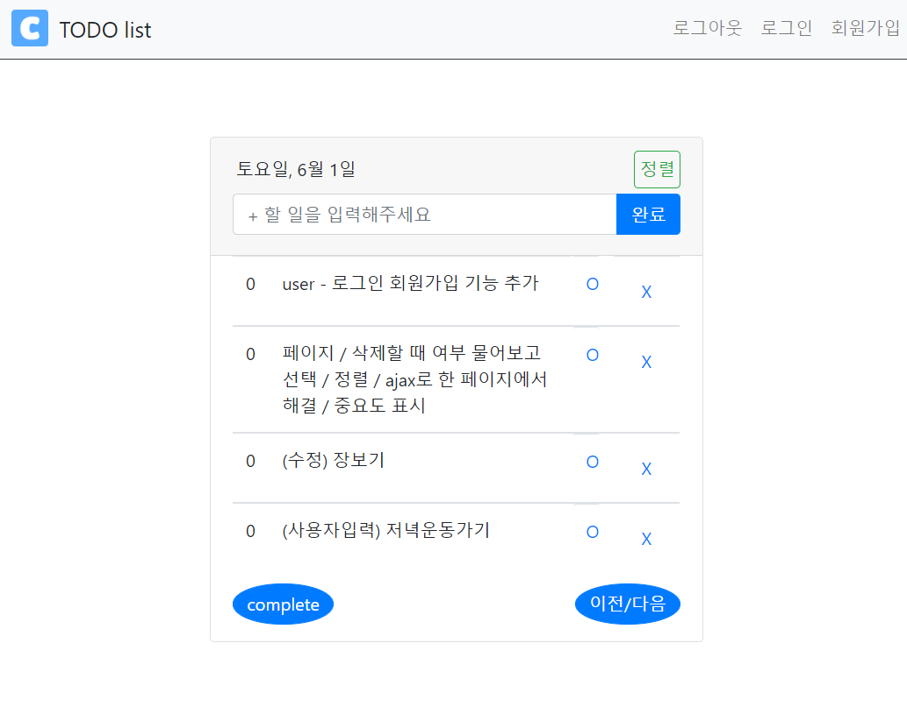

## TODO_web

- todo list 구현하기
- [ychae-leah 티스토리 블로그](https://ychae-leah.tistory.com/category/프로젝트/Flask _ TODO list)에서 진행과정을 보실 수 있습니다!

## tool & environment

- python 3.7
- flask
- MySQL
- Bootstrap / HTML / CSS

## feature

- 해야 할 일 작성하기
  - MySql DB 연결해서 정보 가져오기
- 해야 할 일 수정하기 
- 삭제하기

## 향후 추가해나갈 것

- 회원관리 기능
- 페이지네이션
- 정렬 및 중요도 기능
- ajax로 한 페이지 내에서 처리

